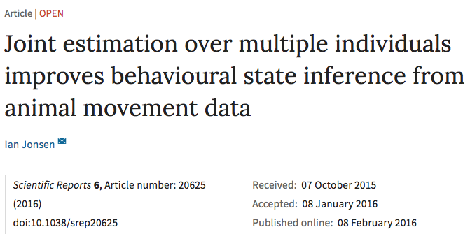

---
output:
  xaringan::moon_reader:
    chakra: libs/remark-latest.min.js
    css: "my-theme.css"
    lib_dir: libs
    nature:
      highlightStyle: github
      highlightLines: true
---

```{r setup, include=FALSE, message=FALSE}
options(htmltools.dir.version = FALSE, servr.daemon = TRUE)
library(huxtable)
```

class: center, middle
# THE DEVELOPMENT AND APPLICATION OF NEW TOOLS IN QUANTITATIVE ECOLOGY
## Mark Scheuerell
_Northwest Fisheries Science Center<br>National Oceanic and Atmospheric Administration<br>Seattle, WA_

.futnote.blue-text[@mark_scheuerell]

.citation.blue-text[\#WSN2017]

---

# Acknowledgments - WSN

.large.blue-text[
## Jenn Caselle

## Brian Gaylord
]

---

# Acknowledgments - colleagues

.large.blue-text[
## Elizabeth Holmes, Jim Thorson, Eric Ward (NOAA)

## Eric Buhle, Kevin See (Quantitative Consultants, Inc)

## Stephanie Hampton, Steve Katz (WSU)

## Brice Semmens (Scripps)
]

---

class: frimg, center 
background-image: url(figs/mit_fire_hose.jpg)
background-size: cover

.white-text[
# I hope you're thirsty!
]

---

# A brief outline

1. Background
.small[
* Early mathematical flute music
* Emergence of cool stuff
* The future of cool stuff
* Can we get through all of this?
]
2. Methods
.small[
* Old school stats
* New school stats
* Software improvements
* Hardware is not soft
]
3. Results
.small[
* Some plots
* Unrelated tangent
* More plots
* Really hard-to-read table
* Horrendogram
]
4. Discussion
.small[
* Where is this headed?
* So much inference
* Did we get through all of this?
* When is he done?
]
5. Supplement
.small[
* There's more?!
* Who does this in a talk?
]

---

class: frimgB, center

# I was trained as a field ecologist


---

# Many advances in methods for naturalists

.blue-text[
## Genetics

## Remote sensing

## Statistics
]

---

class: center

# *Methods in Ecology and Evolution* .small[(Est. 2010)]

```{r timeseries, dpi=300, fig.height=4, fig.width=6, out.height="80%", out.width="80%", fig.align='center', echo=FALSE}
mee <- data.frame(yr=seq(2010,2016),
                  issues=c(4,6,6,12,12,12,12),
                  imp=c(NA,5.1,6,6.6,7.4,8.1,8.6))

pd <- as.matrix(mee[,-1])

par(mfrow=c(2,1), mai=c(0.3,0.4,0.3,0), omi=c(0.1,0,0,0))
## top panel
bp <- barplot(height=rep(NA,7), las=1, ylim=c(0,13),
              col="#488fdf", border=NA, space=1,
              ylab="",
              cex.lab=1.4, yaxt="n")
abline(h=seq(0,12,3), col="gray")
text(0, 1.15*par()$usr[4], cex=1.4,
     "Issues per year", xpd=NA, pos=4)
barplot(height=mee$issues, las=1, add=TRUE,
        col="#488fdf", border=NA, space=1,
        ylab="Issues per year",
        cex.lab=1.4, yaxt="n")
axis(2, at=seq(0,12,3), las=1, tick=FALSE, cex.axis=1.2)
## bottom panel
barplot(height=rep(NA,7), las=1,
        col="darkblue", border=NA, space=1,
        ylim=c(0,9),
        ylab="", cex.lab=1.4, yaxt="n")
abline(h=seq(0,8,2), col="gray")
text(0, 1.1*par()$usr[4], cex=1.4,
     "Impact factor", xpd=NA, pos=4)
barplot(height=mee$imp, las=1, names.arg=mee$yr, add=TRUE,
        col="#ff8100", space=1, border=NA,
        cex.names=1.2,
        ylab="", cex.lab=1.4, yaxt="n")
axis(2, at=seq(0,8,2), las=1, tick=FALSE, cex.axis=1.2)
text(bp[1],1,"NA",col="darkgray", adj=c(0.5,0.5))
```

---

class: center, middle, inverse

# Lots of focus on *hierarchical models*

---

class: frimg, center
background-image: url(figs/horrified.jpg)
background-size: cover

---

# Hi·er·ar·chi·cal

### *adjective*

1. ## Arranged in an order

---

class: center, middle, inverse

# A hierarchical model is simply
# a model within a model

---

# Hierarchical models also masquerade as

.blue-text[
## Nested data models
## Mixed models
## Random-effects models
## State-space models
]

---

class: center, middle, inverse

# A state-space model has 2 parts

---

# Part 1: State model

## Describes the .blue-text[true state of nature] over time or space

```{r state_diag, dpi=300, fig.height=4, fig.width=8, out.height="100%", out.width="100%", fig.align='center', echo=FALSE, warning=FALSE}
par(mai=c(0.8,0.8,0,0), omi=rep(0,4))
## boundaries
ss <- 5
nn <- 7
rr <- ss*3
cc <- ss*nn
## mid-points
xm <- ss/2 + seq(0,cc-ss,ss)
ymt <- rr - ss/2
ymb <- ss/2
## arrow locs
x0t <- seq(ss, by=2*ss, len=3)
x1t <- x0t + ss
## empty plot space
plot(c(0,cc), c(0,rr), type="n", xlab="", ylab="",
     xaxt="n", yaxt="n", bty="n")
## top row: state
symbols(x=xm[c(1,3,5,7)], y=rep(ymt,4), circles=rep(ss/2,4),
        lty="solid",  fg=NA, bg="#488fdf",
        inches=FALSE, add=TRUE, lwd=3)
text("Truth", x=-ss, y=ymt, adj=c(0,0.5), xpd=NA,
     cex=2, col="#488fdf")
arrows(x0=x0t,x1=x1t,y0=ymt, col="#488fdf", lwd=3, length=0.12)
## Time or space
arrows(x0=ss/2, x1=cc-ss/2, y0=-ss/3+ss*2,
       length=0.12, lwd=3, xpd=NA)
text("Time or space", x=cc/2, y=-ss/2+ss*2, xpd=NA, pos=1, cex=2)
```

---

# States of nature might be

.blue-text[
## Animal location
## Species density
## Age structure
## Reproductive status
]

---

class: center, middle, inverse

# Revealing the state of nature
# requires some observations

---

class: center, middle, inverse

# Observing nature can be easy

---

class: frimg, bottom, right
background-image: url(figs/sockeye.jpg)
background-size: cover

# .white-text[How many salmon are there?]

---

class: center, middle, inverse

# Observing nature can also be hard

---

class: frimg, bottom, right
background-image: url(figs/sockeye.jpg)
background-size: cover

# .white-text[How many mayflies are there?]

---

# Part 2: Observation model

## .purple-text[Data] = .blue-text[Truth] &#177; .red-text[Errors]

---

# Part 2: Observation model

## .purple-text[Data] = .blue-text[Truth] &#177; .red-text[Errors]

```{r obs_diag, dpi=300, fig.height=4, fig.width=8, out.height="100%", out.width="100%", fig.align='center', echo=FALSE, warning=FALSE}
par(mai=c(0.8,0.8,0,0), omi=rep(0,4))
## arrow locs
x0t <- seq(ss, by=2*ss, len=3)
x1t <- x0t + ss
y0b <- rr - ss
y1b <- ss
## empty plot space
plot(c(0,cc), c(0,rr), type="n", xlab="", ylab="",
     xaxt="n", yaxt="n", bty="n")
## top row: state
symbols(x=xm[c(1,3,5,7)], y=rep(ymt,4), circles=rep(ss/2,4),
        lty="solid",  fg=NA, bg="#488fdf",
        inches=FALSE, add=TRUE, lwd=3)
text("Truth", x=-ss, y=ymt, adj=c(0,0.5), xpd=NA,
     cex=2, col="#488fdf")
## arrows
arrows(x0=x0t,x1=x1t,y0=ymt, col="#488fdf", lwd=3, length=0.12)
## bottom row: obs
symbols(x=xm[c(1,3,5,7)], y=rep(ss/2,4), circles=rep(ss/2,4),
        lty="solid",  fg=NA, bg="#844870",
        inches=FALSE, add=TRUE, lwd=3)
text("Data", x=-ss, y=ss/2, adj=c(0,0.5), xpd=NA,
     cex=2, col="#844870")
## arrows
arrows(x0=xm[c(1,3,5,7)], y0=y0b, y1=y1b,
       col="#c10101", lwd=3, length=0.12)
## Time or space
arrows(x0=ss/2, x1=cc-ss/2, y0=-ss/3,
       length=0.12, lwd=3, xpd=NA)
text("Time or space", x=cc/2, y=-ss/2, xpd=NA, pos=1, cex=2)
```

---

class: inverse, center, middle

# OK, but why bother?

---

# Advantages of hierarchical models

## 1. Can combine many different .purple-text[data types]

.purple-text[
### Changes in observers or sensors

### Varying survey locations & effort

### Direct & remote sampling  
]

---

# Advantages of hierarchical models

## 2. .gray-text[Missing data] are easily accommodated

```{r obs_NA, dpi=300, fig.height=4, fig.width=8, out.height="100%", out.width="100%", fig.align='center', echo=FALSE, warning=FALSE}
par(mai=c(0.8,0.8,0,0), omi=rep(0,4))
## arrow locs
x0t <- seq(ss, by=2*ss, len=3)
x1t <- x0t + ss
y0b <- rr - ss
y1b <- ss
## empty plot space
plot(c(0,cc), c(0,rr), type="n", xlab="", ylab="",
     xaxt="n", yaxt="n", bty="n")
## top row: state
symbols(x=xm[c(1,3,5,7)], y=rep(ymt,4), circles=rep(ss/2,4),
        lty="solid",  fg=NA, bg="#488fdf",
        inches=FALSE, add=TRUE, lwd=3)
text("Truth", x=-ss, y=ymt, adj=c(0,0.5), xpd=NA,
     cex=2, col="#488fdf")
## arrows
arrows(x0=x0t,x1=x1t,y0=ymt, col="#488fdf", lwd=3, length=0.12)
## bottom row: obs
symbols(x=xm[c(1,3,7)], y=rep(ss/2,3), circles=rep(ss/2,3),
        lty="solid",  fg=NA, bg="#844870",
        inches=FALSE, add=TRUE, lwd=3)
text("Data", x=-ss, y=ss/2, adj=c(0,0.5), xpd=NA,
     cex=2, col="#844870")
## NA's
symbols(x=xm[5], y=ss/2, circles=ss/2,
        lty="solid",  fg=NA, bg="#656565",
        inches=FALSE, add=TRUE, lwd=3)
text("NA", x=xm[5], y=ss/2, cex=1.8, col="#ffffff")
## arrows
arrows(x0=xm[c(1,3,7)], y0=y0b, y1=y1b,
       col="#c10101", lwd=3, length=0.12)
## Time or space
arrows(x0=ss/2, x1=cc-ss/2, y0=-ss/3,
       length=0.12, lwd=3, xpd=NA)
text("Time or space", x=cc/2, y=-ss/2, xpd=NA, pos=1, cex=2)
```

---

class: frimg

# Advantages of hierarchical models

## 3. Improved accuracy & precision

.img-left-land[]

---

# Advantages of hierarchical models

## 4. Rather flexible

.center.blue-text[
### This simple model can be used for 5+ unique applications!
]

$$\mathbf{x}_t = \mathbf{B} \mathbf{x}_{t-1} + \mathbf{w}_t \\
  \mathbf{y}_t = \mathbf{Z} \mathbf{x}_t + \mathbf{v}_t$$

---

class: inverse, center, middle

# How do I actually do this?

---

# Many software options

## .blue-text[Canned **R** packages] (MARSS<sup>*</sup>, dlm, vars)

## .blue-text[Code-your-own] (JAGS, Stan, greta)

.footnoteSm.gray-text[
<sup>\*</sup>See Holmes, Ward & Scheuerell (2014) for *lots* of worked examples
]

---

class: frimg
background-image: url(figs/snake_oil.jpg)
background-size: cover

---

class: inverse, center, middle

# AN EXAMPLE

---

# Conservation of Pacific salmon

.blue-text[
## 50% of salmon populations along the US West Coast are listed under the Endangered Species Act
]

---

class: frimg
background-image: url(figs/suppl_scheme.png)
background-position: 50% 85%
background-size: 80%

# Recovery options for Pacific salmon

.blue-text[
## One strategy is hatchery supplementation
]

---

# Evaluating conservation interventions

.blue-text[
## Has 30+ years of hatchery supplementation boosted the production of wild salmon in the Snake R?
]

---

class: frimg
background-image: url(figs/suppl_esu.png)
background-size: 90%

---

class: frimg
background-image: url(figs/suppl_ts.png)
background-position: 70% 45%
background-size: 70%

.topleft.blue-text[
## Supplementation is ad hoc
]

---

class: frimg
background-image: url(figs/suppl_eff.png)
background-position: 50% 35%
background-size: 120%

# Effect size is rather subtle

.blue-text[
## Probability of positive effect = 0.73
]

.citationT.gray-text[Scheuerell et al. (2015) *Ecol* & *Evol* &nbsp; 5:2115–2125]

---

class: inverse, center, middle

# ANOTHER EXAMPLE

---

# Emergence of high-dimension data

.blue-text[
## Remote sensing
## Citizen science
## Large-scale surveys
]

---

# Groundfish surveys along the West Coast

.blue-text[
## Massive effort to assess stock status & set catch limits for 100+ species
]

---

# Data reduction techniques

.blue-text[
## Can we detect a few common patterns in the data?
]

---

class: frimg
background-image: url(figs/sfa_1.png)
background-position: 50% 30%
background-size: 65%

.citationT.gray-text[Thorson et al. (2015) *Meth* *Ecol* & *Evol* 6:627–637]

---

class: frimg
background-image: url(figs/sfa_2.png)
background-position: 50% 30%
background-size: 75%

.citationT.gray-text[Thorson et al. (2015) *Meth* *Ecol* & *Evol* 6:627–637]

---

# Other applications of hierarchical models

## .blue-text[Identifying metapopulation structure]

### .right[Ward et al (2010) *J Appl Ecol* &nbsp; 47:47–56]

---

# Other applications of hierarchical models

## .blue-text[Reducing bias in estimates of density dependence] 

### .right[Knape & de Valpine (2012) *Ecol Lett* &nbsp; 15:17–23]

---

# Other applications of hierarchical models

## .blue-text[Improving precision in species extinction forecasts] 

### .right[See & Holmes (2015) *Ecol Appl* &nbsp; 25:1157–1165]

---

# In summary

.blue-text[
## There is plethora of new methods for naturalists

## Among them, hierarchical models show real promise

## Software & hardware improvements open new doors
]

.futnote.blue-text[@mark_scheuerell]

.citation.blue-text[\#WSN2017]

---

##  Slide deck

### https://github.com/mdscheuerell/WSN2017

## Image sources

.left.blue-text[
### Drinking fountain: *Massachusetts Inst Tech*
### Janet Leigh: *Paramount Studios*
### Snake oil: *The Register*
]

.futnote.blue-text[@mark_scheuerell]

.citation.blue-text[\#WSN2017]
